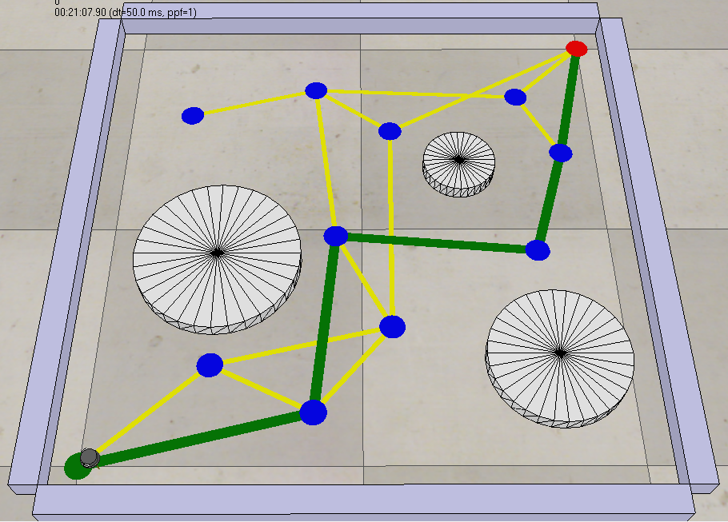

# Minimum Cost Path Implementation for Robot Motion Planning Project 🤖

This repository contains my implementation of the **A\* search algorithm** for optimizing the path for a robot motion, developed as a programming project for the Coursera course "Modern Robotics, Course 4: Robot Motion Planning and Control."

---

## 💡 Project Overview 

The Minimum Cost Path Implementation for Robot Motion Planning Project requires implementing the A* search algorithm to find a minimum-cost path on an undirected weighted graph. The graph nodes and edges are specified in CSV files, and the program outputs the minimum-cost path from a start node (node 1) to a goal node (node N) as a sequence of nodes.

The project integrates with **CoppeliaSim (formerly V-REP)** simulator to visualize the graph, obstacles, and the resulting path, for the demonstration of the solution path with a mobile robot (Kilobot).

---

## 🛠️ Technology Used

- **Language:** Python
- **Libraries/Modules:** csv, heapq, os, collections (all part of the Python Standard library, no external installation required). 
- **Simulation Tool:** CoppeliaSim (Edu Version)

---

## 📐 A* Search Implementation
The core of the project is the A* search algorithm, which minimizes the **total estimated path cost:** 

**$f(n) = g(n) + h(n)$**, where:

$g(n)$ (Past Cost): The actual cost of the path from the start node to node $n$.

$h(n)$ (Heuristic Cost): The estimated cost of the cheapest path from node $n$ to the goal node.

---

## 📁 Project Folder Structure
<pre>
├── code/
│ ├── a_star_search_algorithm.py # Python program implementing A* search algorithm
├── results/
│ ├── edges.csv
│ ├── nodes.csv
│ ├── obstacles.csv
│ └── path.csv # solution path output by the program
├── LICENSE
├── README.md
├── recording_A_star_search_robot_planner_simulation.avi
├── Scene5_motion_planning.ttt
└── screenshot_A_star_search_robot_planner.png
</pre>
    
---

## 🚀 Getting Started

---

1. **Prerequisites**

- Python 3.x Interpreter
- Git
- Integrated Development Environment (IDE) e.g. Visual Studio Code
- CoppeliaSim simulator (Educational Version) to visualize the graph and the path results - download from [CoppeliaRobotics](https://www.coppeliarobotics.com/) Website.

---

## ▶️ Steps to Run the Code

1.  **Clone the Repository:**

    Open the terminal and run the following command:

    ```bash
    git clone https://github.com/Oluwatobi-coder/Minimum-Cost-Path-Implementation-for-Robot-Motion-Planning-Project.git
    ```
2.  **Navigate to the project directory:**

    ```bash
    cd Minimum-Cost-Path-Implementation-for-Robot-Motion-Planning-Project
    ```
3.  **Execute the Motion Planner Program:** 
    
    Run the following command:

    ```bash
    python code/a_star_search_algorithm.py
    ```

---

## 📄 Input File Formats

- `nodes.csv`: Contains node IDs, (x,y) coordinates and heuristic-cost-to-go i.e. nodeID,x,y,heuristic-cost-to-go
- `edges.csv`: Contains edges between nodes and their associated costs i.e. ID1,ID2,cost
- `obstacles.csv`: Contains (x,y) coordinates of the center of the cylinder and its diameter i.e. x,y,diameter. Used only by CoppeliaSim for visualization of obstacles. Not required by the search algorithm.

---

## 📊 Results and Output

The primary output is the file **`path.csv`**, which is a single line containing the optimal path.

| Scenario | `path.csv` Output Format |
| :--- | :--- |
| **Path Found** | `1, node2, node3, ..., N` (A comma-separated list of node IDs from start to goal) |
| **No Path Found** | `1` (Indicates no connection was found between start and goal) |

---

## 🌐 Simulation (CoppeliaSim)
- To visualize the path in CoppeliaSim:
1. Open the `Scene5_motion_planning.ttt` scene file in CoppeliaSim.
2. Start the Simulation, then copy and paste the absolute path of the `results` directory in the field provided and click the **Open Files** button.
3. Press play to see the mobile robot (Kilobot) traverse the calculated minimum-cost path.

---

## 📸 Screenshot of the Solution Path



---

# 📜 License
This project is licensed under the MIT License. See the `LICENSE` file for details.

---

## 📚 References

- A* search algorithm (Wikipedia). Available at: [A* Star Wikipedia Page](https://en.wikipedia.org/wiki/A*_search_algorithm#:~:text=Peter%20Hart%2C%20Nils%20Nilsson%20and,specific%2Dgoal%2Ddirected%20heuristic.)
- Course: Modern Robotics, Course 4: Robot Motion Planning and Control, Coursera
- Project webpage: [A* Graph Search Project](https://hades.mech.northwestern.edu/index.php/A*_Graph_Search_Project)
